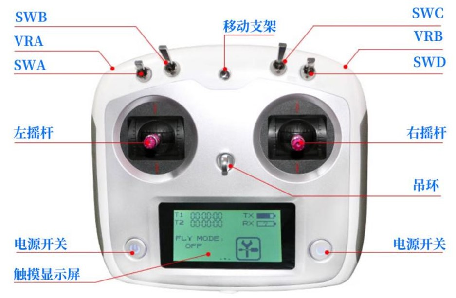

## adora_chassis_bringup 

测试环境为 ubuntu22.04 ROS2 humble

## 1  Adora A2 max 底盘
依赖项
```
sudo apt install ros-humble-asio-cmake-module
```
### 1.1  Adora A2 max  (ROS2节点)
启动A2 mini 底盘节点

```
ros2 launch adora_chassis_bringup adora_a2_max_ros2.launch.py
```

 在启动ROS包后，可以通过以下命令查看ROS包发布的话题内容。

-  查看原始数据   ros2 topic echo /dt/buff_info
- 查看回充状态  ros2 topic echo /dt/charge_info
- 查看电机电流  ros2 topic echo /dt/current_info
- 查看出货日期 ros2 topic echo /dt/date_info
- 查看驱动器错误 ros2 topic echo /dt/drive_error_info
- 查看硬件版本  ros2 topic echo /dt/hardware_version_info
- 查看底盘参数  ros2 topic echo /dt/parameter_info
- 查看遥控数据  ros2 topic echo /dt/remote_ctrl_info
- 查看软件版本  ros2 topic echo /dt/software_version_info
- 查看底盘状态  ros2 topic echo /dt/state_info
- 查看里程信息  ros2 topic echo /dt/odom_info


### 1.2 通过话题控制Adora A2 max 底盘

将遥控器SWB 摇杆拨到中间位置进入上位机遥控模式。 然后，新建终端，通过ROS话题向/adora_robot/chassis/cmd_vel 话题发布数据 控制小车移动（注意 将遥控器左上角拨码开关拨到最上，表示开启自动驾驶模式）

```
ros2 topic pub -r 10 /adora_robot/chassis/velocity_ctrl geometry_msgs/msg/Twist "{
  linear: {x: 0.0, y: 0.0, z: 0.0},
  angular: {x: 0.0, y: 0.0, z: 0.5}
}"
```

角速度方向： 逆时针为正，速度方向：车头方向为x方向。
## 2  Adora A2 mini 底盘
### 2.1  Adora A2 mini (ROS2节点)

启动A2 mini 底盘节点

```
ros2 launch adora_chassis_bringup adora_a2_mini_ros2.launch.py
```

参数解释：

```
usart_port： 外部串口名称
baud_data：波特率
control_mode：车辆底盘控制模式
```

节点启动以后会对外申明以下话题：

```
/adora_robot/chassis/DT_Robot_agv1
/adora_robot/chassis/DT_Robot_agv2
/adora_robot/chassis/cmd_vel
/adora_robot/chassis/collision_release
/adora_robot/chassis/go_charge
/adora_robot/chassis/go_stop
```

其中，移动机器人接收话题 /adora_robot/chassis/cmd_vel 的控制指令，消息类型为 geometry_msgs::msg::Twist 

### 2.2 通过话题控制小车

将遥控器SWB 摇杆拨到中间位置进入上位机遥控模式。 然后，新建终端，通过ROS话题向/adora_robot/chassis/cmd_vel 话题发布数据 控制小车移动（注意 将遥控器左上角拨码开关拨到最上，表示开启自动驾驶模式）

```
ros2 topic pub -r 10 /adora_robot/chassis/cmd_vel geometry_msgs/msg/Twist "{
  linear: {x: 0.0, y: 0.0, z: 0.0},
  angular: {x: 0.0, y: 0.0, z: 0.5}
}"
```

角速度方向： 逆时针为正，速度方向：车头方向为x方向。


## 3 遥控器说明

**电源开关**：同时长按电源按钮，开启/关闭遥控器电源。

 

**遥控解锁**：电源开启后，需要将SWA/B/C/D四个开关拨到最上面的位置，解锁遥控器。

 

**安全遥控**：遥控器解锁后，再将SWA/B/C/D四个开关拨到最下面的位置，即为安全遥控模式。**安全遥控模式解释**：SWA(下)半速模式，SWB(下)遥控模式，SWC(下)无功能，SWD(下)取消急停。


**防撞杠误触解除**：当防撞杠碰撞触发无法移动时，SWD上下摆动可恢复正常状态（该功能也可在车子的红色急停按钮恢复，恢复方式：按下急停 -> 解开急停）





| 摇杆/开关       | 功能         | 说明                                                         |
| --------------- | ------------ | ------------------------------------------------------------ |
| 左摇杆          | 前进         | 左摇杆上拨↑                                                  |
| 左摇杆          | 后退         | 左摇杆下拨↓                                                  |
| 右摇杆          | 左转         | 右摇杆左拨←                                                  |
| 右摇杆          | 右转         | 右摇杆右拨→                                                  |
| SWA(上·下)      | 半速         | SWA开关(上)：全速  SWA开关(下)：半速                         |
| SWB(上·中·下)   | 控制模式选择 | SWB(上)：进入回充模式  SWB(中)：上位机控制模式  SWB(下)：遥控器控制模式 |
| SWC(上·中·下)   | 无           | SWC(上·中·下)：无功能                                        |
| SWD(上·下)      | 急停         | SWD(上)：启用急停  SWD(下)：取消急停                         |
| VRA(上·回中·下) | 无           | 无                                                           |
| VRB(上·回中·下) | 无           | 无                                                           |
