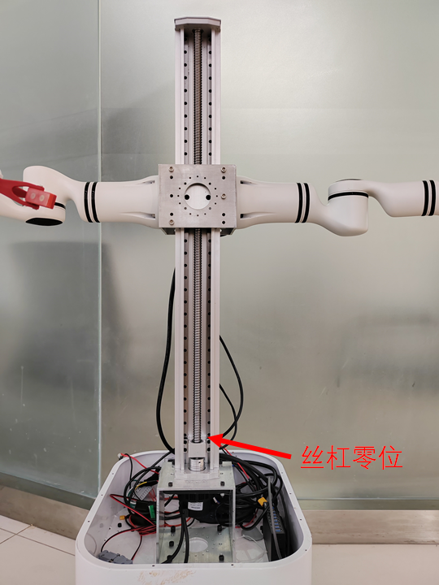

adora_lifting_motor_control该节点为丝杠电机对应的ROS2 节点。

## 控制

节点启动命令

```
 ros2 launch adora_lifting_motor_control adora_a2_max_ros2_node.launch.py
```

节点启动后会等待“ /adora/lifting_motor/cmd”话题上发送的数据，可以新建一个终端对该话题发送电机位置数据，即可实现电机位置控制。

```
ros2 topic pub -r 100 /adora/lifting_motor/cmd std_msgs/msg/UInt32 "{data: 300}"
```

其中数值 300 表示运动到相对于零位升高300mm位置，Adora A2 Max丝杠行程是700mm，Adora A2 Pro机器人的丝杠行程是900mm。电机转动1圈的编码器反馈原始数值是32768.

## 状态反馈

节点启动以后会向外发一个话题 “ **/adora/lifting_motor/states”**，该话题的数据类型为 “ **std_msgs/msg/UInt32”**  代表距离丝杆零位的高度（单位mm）。

丝杠电机供电电压为24V，丝杠的零位位于靠近电机侧位置，如下图所示


